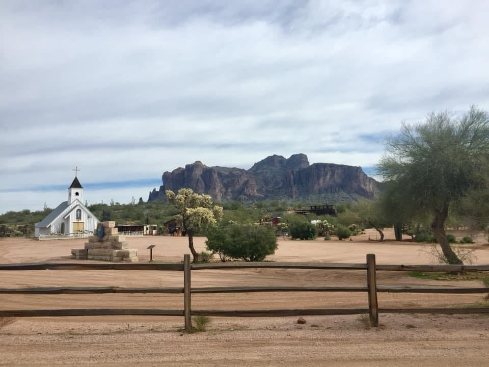

# WEEK-20-CHALLENGE-REACT-PORTFOLIO

  

  ## Table of Contents

  - [Description](#description)
  - [Screenshoot](#screenshot)
  - [Questions](#questions)
  - [Credits](#credits)
  - [License](#license)

    
  ## Description
  A React App to showcase my work with other developers and future employers.

  ## Screenshot
 
  

  ## Questions
  CONTACT: Amanda Lacroix
  EMAIL: amanda_lacroix@hotmail.com
  REPO: https://github.com/Amanda-Lacroix/WEEK-20-CHALLENGE-REACT-PORTFOLIO 

  ## Credits
 - Starter code provided by: create-react-app for React
 - HTML/CSS from https://amanda-lacroix.github.io/WEEK-2-CHALLENGE/
 

  ## License
  [MIT]( https://opensource.org/licenses/MIT)
